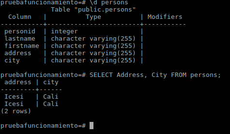

### TALLER MIRROR

### Estudiantes: 
**Jorge Hernandez - A00317220**

**Esteban Camacho - A00320168**

### Objetivo 
1.Crear una maquina virtual para que sirva como mirror que contenga los archivos de Postgresql.

2.Crear un contenedor que descargue Postgresql desde el mirror creado.


### Procedimiento

* Montar el mirror. Para esto se uso el siguiente vagrantfile
``` python
VAGRANTFILE_API_VERSION = "2"

Vagrant.configure(VAGRANTFILE_API_VERSION) do |config|
  config.ssh.insert_key = false
  config.vm.define :mirror do |trusty|
    trusty.vm.box = "trusty"
    trusty.vm.network "private_network", ip: "192.168.131.10"
    trusty.vm.network "public_network", bridge: "enp5s0", ip: "192.168.131.11"
    trusty.vm.provider :virtualbox do |vb|
      vb.customize ["modifyvm", :id, "--memory", "1024","--cpus", "1", "--name", "mirror" ]
    end
  end
end
```


* Una vez montado el mirror se genero y exporto una llave para seguridad

*   Se usaron los siguientes comandos:
```
$ gpg --gen-key
$ cat /dev/urandom
$ gpg --no-default-keyring --keyring /usr/share/keyrings/ubuntu-archive-keyring.gpg --export | gpg --no-default-keyring --keyring trustedkeys.gpg --import
$ gpg --export --armor > my_key.pub
$ scp vagrant@192.168.131.10:/tmp/my_key.pub .
```
* una vez copiada la llave al equipo remoto se procedio a instalar aptly en el mirror(maquina virtual)
* Se usaron los siguientes comandos
```
$ echo deb http://repo.aptly.info/ squeeze main > /etc/apt/sources.list
$ sudo apt-key adv --keyserver keys.gnupg.net --recv-keys 9E3E53F19C7DE460
$ apt-get update
$ apt-get install aptly
```
* Luego de instalar aptly creamos el mirror a traves de aptly con el siguiente comando
```
$ aptly mirror create -architectures=amd64 -filter='Priority (required) | Priority (important) | Priority (standard) | postgresql' -filter-with-deps xenial-main-postgresql http://mirror.upb.edu.co/ubuntu/ xenial main
```
* Y lo actualizamos para que descargue los paquetes necesarios
```
$ aptly mirror update xenial-main-postgresql
```


* Para que los paquetes fueran visibles para otras maquinas se ejecutaron los siguientes comandos
```
$ aptly snapshot create xenial-snapshot-postgresql from mirror xenial-main-postgresql
$ aptly publish snapshot xenial-snapshot-postgresql
```
* Finalmente se inicia el mirror.


### Construccion del contenedor

* Se construyo el siguiente Dockerfile 
``` python
FROM ubuntu:16.04
MAINTAINER tebannew@gmail.com	

ADD config/my_key.pub /tmp

#COnfigure repositorio
RUN apt-key add /tmp/my_key.pub && \
    rm -f /tmp/my_key.pub && \
    echo "deb http://192.168.131.11:8080/ xenial main" >  /etc/apt/sources.list && \
    chmod 777 /tmp

#Install packege
RUN apt-get clean -y
RUN apt-get update -y
RUN apt-get install postgresql -y

#Configuracion del puerto de python
#CMD service apache2 start && tail -f /var/log/apache2/access.log
EXPOSE 5432
CMD postgresql -m http.server 5432
```
* Luego se ejecutaron los siguientes comandos
```
$ docker build -t ubuntu_postgresql:1.0 .

$ docker run -it --rm ubuntu_postgresql:1.0 /bin/bash
```


### Pruebas de funcionamiento
```
psql --version

```


* Activación postgres
```
 $ /etc/init.d/postgresql start
```
* Luego cambiamos al usuario que viene por defecto para poder trabajar en las bases de datos
```
$ su - postgres
```
* Vamos a la consola de postgres
```
$ psql
```
* Creamos la base de datos
```
CREATE DATABASE pruebaFuncionamiento;
```
* Verificamos que este 

```
\1
```


* Nos conectamos
```
\c pruebafuncionamiento
```

* Luego creamos una tabla
``` python
CREATE TABLE Persons (
    PersonID int,
    LastName varchar(255),
    FirstName varchar(255),
    Address varchar(255),
    City varchar(255) 
);
```
* comprobamos que se creo correctamente


* Insertamos datos
``` python
INSERT INTO persons (PersonID, LastName, FirstName, Address, City) VALUES (2, 'Molano', 'Oscar', 'Icesi', 'Cali');
INSERT INTO persons (PersonID, LastName, FirstName, Address, City) VALUES (3, 'Ocampo', 'Daniel', 'Icesi', 'Cali');
```
* Y por ultimo realizamos una consulta
``` python
SELECT Address, City FROM persons;
```

